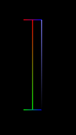
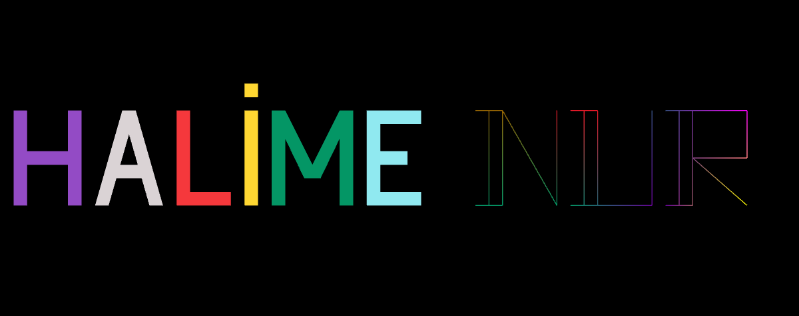

# WebGL ile Basit Grafik Çizimi

Bu proje, WebGL kullanarak HTML Canvas üzerinde basit grafik çizimlerini yapar. Aşağıda, projede kullanılan sınıf ve fonksiyonların kısa açıklamaları bulunmaktadır.

## Sınıflar

### `Character`

`Character` sınıfı, bir harfin pozisyon, renk ve dönüşüm bilgilerini tutar ve çizim işlemlerini gerçekleştirir.

- **Özellikler**
  - `name`: Karakterin adı.
  - `rotation`: Karakterin dönüş açısı.
  - `translation`: Karakterin x ve y eksenindeki kaydırma miktarı.
  - `scaling`: Karakterin ölçeklendirme faktörü.
  - `color`: Karakterin renk bilgileri.
  - `vertices`: Karakterin vertex bilgileri.
  - `index`: Çizim yapılırken takip edilecek indeks bilgileri

- **Yöntemler**
  - `setVerticesAndColor(x, y, R, G, B)`: Belirtilen koordinatlar ve renklerle vertex ekler.
  - `setColor(R, G, B)`: Karakterin rengini ayarlar.
  - `setIndex(array)`: Çizim için kullanılan indeksleri ayarlar.
  - `setTranslation(x, y)`: Karakterin kaydırma miktarını ayarlar.
  - `setRotation(angle)`: Karakterin dönüş açısını ayarlar.
  - `setScaling(scale)`: Karakterin ölçeklendirme faktörünü ayarlar.
  - `createVertexBuffer()`: Vertex buffer oluşturur.
  - `createColorBuffer()`: Renk buffer'ı oluşturur.
  - `draw(primitiveType)`: Karakteri belirtilen primitiv türü ile çizer.

## Fonksiyonlar

### `createL()`

`L` harfini oluşturan bir `Character` nesnesi oluşturur ve vertex ve renk bilgilerini ayarlar. Oluşturulan nesneyi döndürür.

### `drawL()`

`createL()` ile oluşturulan nesneyi `TRIANGLE_FAN` kullanarak çizer.

### `createI()`

`I` harfini oluşturan bir `Character` nesnesi oluşturur ve vertex ve renk bilgilerini ayarlar. Oluşturulan nesneyi döndürür.

### `drawI()`

`createI()` ile oluşturulan nesneyi `POINTS` kullanarak çizer.

### `drawPoint()`

Bir noktayı çizer.

### `drawA()`

`A` harfini `TRIANGLE_FAN` ile çizer.

### `drawM()`

Önce `M` harfinin yarısını çizer. Daha sonra y ekseninde yansıtarak diğer yarısını çizer. Çizim işlemi için `TRIANGLE_FAN` kullanılmıştır.

### `drawE()`

`createI()` ile oluşturulan `L` harfini de kullanarak bir `E` harfi çizer. `TRIANGLE_FAN` kullanılmıştır.

### `drawH()`

`createL()` ve `createI()` fonksiyonlarını kullanarak birer adet "L" ve "I" harflerini oluşturur. Önce L harfinin boyutunu yarıya düşürür. Ardından x ve y eksenlerinde yansıtarak toplam 4 kez çizer ve `H` harfinin ana iskeleti oluşur. Dikey çizgilerin kalınlığını arttırmak için de 4 adet I harfi yanlara eklenir.

### `createIwLines()`

- `I` harfini yatay ve dikey çizgilerle oluşturan bir `Character` nesnesi oluşturur. Görüntüsü aşağıdaki gibidir:
- 

### `drawN()`

`createIwLines()` ile oluşturulan `I` harfine çizgiler ekleyerek `N` harfini çizer.

### `drawU()`

`createIwLines()` ile oluşturulan `I` harfine ekleme yaparak `U` harfini çizer.

### `drawR()`

`createIwLines()` ile oluşturulan `I` harfine ekleme yaparak `R` harfini çizer.

## Ekran çıktısı

